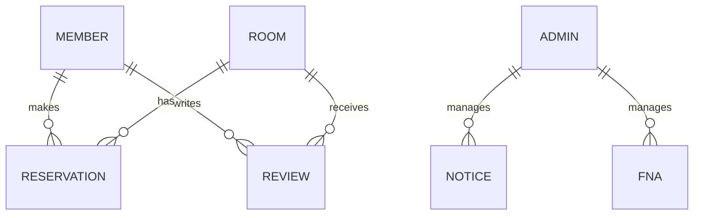

# 🎉 MyPartyRoom 🎊

<div align="center">
  
  [](https://spring.io/projects/spring-boot)
  [](https://www.oracle.com/java/)
  [](https://mariadb.org/)
  [](https://mybatis.org/mybatis-3/)
  [](https://www.oracle.com/java/technologies/jspt.html)
  
  **🏠 지역 기반 파티룸 예약 플랫폼 🏠**
  
  *여러분의 특별한 이벤트를 위한 완벽한 공간을 찾아보세요!*
  
  ⚠️ **현재 개발 진행 중** ⚠️
</div>

## 🌟 프로젝트 소개

**MyPartyRoom**은 사용자가 손쉽게 파티룸을 찾고 예약할 수 있는 올인원 플랫폼입니다. 지역별 맞춤 검색부터 실시간 예약, 리뷰 시스템까지 파티룸 이용에 필요한 모든 기능을 제공합니다.

<table>
  <tr>
    <td>🗓️ <b>개발 기간</b></td>
    <td>2025년 2월 ~ 진행 중</td>
  </tr>
  <tr>
    <td>👩‍💻 <b>개발 인원</b></td>
    <td>1인 (개인 프로젝트)</td>
  </tr>
  <tr>
    <td>🎯 <b>목표</b></td>
    <td>Spring Framework 실전 역량 강화 & 포트폴리오 구축</td>
  </tr>
</table>

## ✨ 주요 기능

### 👤 사용자 기능
```
📱 계정 관리 - 회원가입, 로그인, 프로필 설정
🔍 파티룸 검색 - 지역/날짜/인원 기반 맞춤 검색
📅 예약 관리 - 실시간 예약 생성 및 취소
⭐ 리뷰 작성 - 별점 평가 및 사진 첨부 리뷰
```

### 🏢 업체 기능
```
📋 업체 관리 - 파티룸 등록 및 정보 관리
✅ 예약 처리 - 예약 승인/거절 및 일정 관리
📊 매출 분석 - 기간별 예약 통계 및 매출 보고서
```

### 👑 관리자 기능
```
📢 콘텐츠 관리 - 공지사항 및 FAQ 관리
👮 회원 관리 - 일반 회원 및 업체 계정 관리
🚫 신고 처리 - 부적절한 컨텐츠 관리
```

## 🔧 기술 스택

<details>
<summary><b>💻 백엔드</b></summary>
<br>
<ul>
  <li>Java 17</li>
  <li>Spring Boot 3.4.3</li>
  <li>Spring MVC</li>
  <li>MyBatis 3.0.4</li>
  <li>MariaDB</li>
  <li>Lombok</li>
</ul>
</details>

<details>
<summary><b>🎨 프론트엔드</b></summary>
<br>
<ul>
  <li>JSP</li>
  <li>JSTL</li>
  <li>Sitemesh 3</li>
  <li>JavaScript</li>
  <li>CSS</li>
</ul>
</details>

<details>
<summary><b>🧰 개발 도구</b></summary>
<br>
<ul>
  <li>Maven</li>
  <li>Spring DevTools</li>
  <li>Tomcat Embed Jasper</li>
</ul>
</details>

## 📊 데이터베이스 구조



> 📝 전체 데이터베이스 스키마는 [`sql/mypartyroom.sql`](./sql/mypartyroom.sql) 파일에서 확인할 수 있습니다.

## 🚀 실행 방법

### 📋 사전 요구사항
- JDK 17 이상
- Maven
- MariaDB

### ⚙️ 설치 및 실행

<details>
<summary><b>1️⃣ 데이터베이스 설정</b></summary>
<br>

```sql
-- MariaDB 접속
mysql -u root -p

-- 데이터베이스 생성
CREATE DATABASE mypartyroom;

-- SQL 스크립트 실행
mysql -u root -p mypartyroom < sql/mypartyroom.sql
```
</details>

<details>
<summary><b>2️⃣ 애플리케이션 설정</b></summary>
<br>

`application.properties` 설정:
```properties
spring.datasource.driver-class-name=org.mariadb.jdbc.Driver
spring.datasource.url=jdbc:mariadb://localhost:3306/mypartyroom
spring.datasource.username=YOUR_USERNAME
spring.datasource.password=YOUR_PASSWORD

spring.mvc.view.prefix=/WEB-INF/views/
spring.mvc.view.suffix=.jsp
```
</details>

<details>
<summary><b>3️⃣ 빌드 및 실행</b></summary>
<br>

```bash
# 프로젝트 빌드
mvn clean package

# 애플리케이션 실행
java -jar target/mypartyroom-0.0.1-SNAPSHOT.jar

# 또는 Maven으로 직접 실행
mvn spring-boot:run
```

🌐 브라우저에서 `http://localhost:8080` 접속
</details>

## 📈 개발 진행 상황

<div align="center">
  <table>
    <tr>
      <th>기능</th>
      <th>상태</th>
      <th>완료 예정</th>
    </tr>
    <tr>
      <td>프로젝트 기초 설정</td>
      <td>✅ 완료</td>
      <td>2025.02</td>
    </tr>
    <tr>
      <td>데이터베이스 설계</td>
      <td>✅ 완료</td>
      <td>2025.02</td>
    </tr>
    <tr>
      <td>파티룸 검색 기능</td>
      <td>✅ 완료</td>
      <td>2025.03</td>
    </tr>
    <tr>
      <td>회원 시스템</td>
      <td>⏳ 진행 중</td>
      <td>2025.04</td>
    </tr>
    <tr>
      <td>예약 시스템</td>
      <td>⏳ 진행 중</td>
      <td>2025.04</td>
    </tr>
    <tr>
      <td>리뷰 시스템</td>
      <td>⏳ 진행 중</td>
      <td>2025.04</td>
    </tr>
    <tr>
      <td>업체 대시보드</td>
      <td>⏳ 진행 중</td>
      <td>2025.04</td>
    </tr>
    <tr>
      <td>관리자 기능</td>
      <td>⏳ 진행 중</td>
      <td>2025.04</td>
    </tr>
    <tr>
      <td>UI/UX 개선</td>
      <td>⏳ 진행 중</td>
      <td>2025.04</td>
    </tr>
  </table>
</div>

## 🔮 향후 계획

- **🧩 기능 완성** - 현재 진행 중인 모든 기능을 4월 말까지 완성
- **🛠️ 안정화 작업** - 개발된 기능의 버그 수정 및 성능 최적화
- **📝 코드 리팩토링** - 코드 품질 개선 및 유지보수성 강화

## 👨‍💻 개발자 정보

<div align="center">
  
  **MeronaKiller**
  
  [](https://github.com/MeronaKiller)
  [](mailto:kkwsi1010@gmail.com)
  
</div>

---

<div align="center">
  <sub>© 2025 MyPartyRoom. All rights reserved.</sub>
</div>
