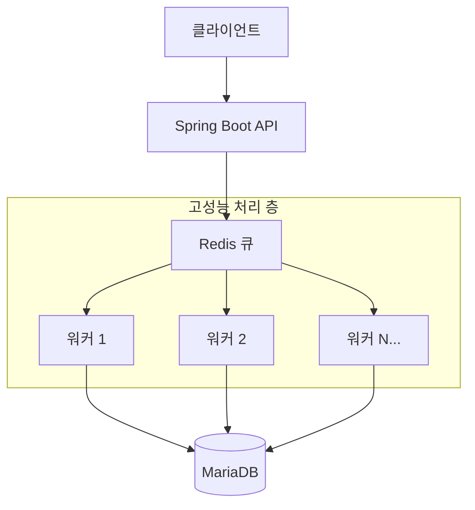

# 🎉 MyPartyRoom 🎊

<div align="center">
  
  [](https://spring.io/projects/spring-boot)
  [](https://www.oracle.com/java/)
  [](https://mariadb.org/)
  [](https://redis.io/)
  [](https://mybatis.org/mybatis-3/)
  
  **🏠 고성능 지역 기반 파티룸 예약 플랫폼 🏠**
  
  *여러분의 특별한 이벤트를 위한 완벽한 공간을 찾아보세요!*
  
  ✅ **프로젝트 완료** ✅
</div>

## 🌟 프로젝트 소개

**MyPartyRoom**은 사용자가 손쉽게 파티룸을 찾고 예약할 수 있는 종합 플랫폼입니다. 지역별 맞춤 검색부터 실시간 예약, 리뷰 시스템까지 파티룸 이용에 필요한 모든 기능을 제공하며, Redis 기반 고성능 아키텍처로 안정적인 서비스를 보장합니다.

<table>
  <tr>
    <td>🗓️ <b>개발 기간</b></td>
    <td>2025년 2월 ~ 2025년 5월 17일 (완료)</td>
  </tr>
  <tr>
    <td>👩‍💻 <b>개발 인원</b></td>
    <td>1인 (개인 프로젝트)</td>
  </tr>
  <tr>
    <td>🎯 <b>목표</b></td>
    <td>완전한 파티룸 예약 플랫폼 구축 & Spring 실전 역량 강화</td>
  </tr>
  <tr>
    <td>🚀 <b>핵심 특징</b></td>
    <td>Redis 분산 처리로 동시 접속 시에도 안정적인 예약 서비스</td>
  </tr>
</table>

## 🏗️ 기술적 특징

### 고성능 예약 처리 시스템
- **Redis 분산 락**: 동시 예약 요청 시 데이터 무결성 보장
- **큐 기반 처리**: 비동기 처리로 사용자 응답 속도 개선
- **배치 처리**: 데이터베이스 부하 최소화
- **확장 가능한 아키텍처**: 트래픽 증가에 유연하게 대응

## ✨ 주요 기능

### 👤 사용자 기능
- **📱 계정 관리** - 회원가입, 로그인
- **🔍 파티룸 검색** - 키워드 기반 맞춤 검색
- **📅 예약 관리** - 고성능 실시간 예약 생성 및 취소


### 👑 관리자 기능
- **📢 콘텐츠 관리** - 공지사항 및 FAQ 관리
- **👮 회원 관리** - 일반 회원 및 업체 계정 관리
- **📋 업체 관리** - 파티룸 등록 및 정보 관리
- **✅ 예약 처리** - 예약 승인/거절 및 일정 관리

## 🔧 기술 스택

### 💻 백엔드
- **Java 17** - 최신 LTS 버전으로 안정성 확보
- **Spring Boot 3.4.3** - 최신 Spring 생태계 활용
- **Spring MVC** - RESTful API 구축
- **MyBatis 3.0.4** - 효율적인 SQL 매핑
- **MariaDB** - 안정적인 관계형 데이터베이스
- **Redis** - 고성능 분산 캐시 및 큐 시스템
- **Redisson** - Redis 기반 분산 락 구현

### 🎨 프론트엔드
- **JSP & JSTL** - 서버 사이드 렌더링
- **Sitemesh 3** - 레이아웃 데코레이터
- **JavaScript & CSS** - 동적 UI 구현

### 🧰 개발 및 배포
- **Maven** - 의존성 관리 및 빌드 자동화
- **Spring DevTools** - 개발 생산성 향상
- **Lombok** - 코드 간소화

## 📊 시스템 아키텍처



## 🚀 실행 방법

### 📋 사전 요구사항
- JDK 17 이상
- Maven 3.8+
- MariaDB 10.5+
- Redis 6.0+

### ⚙️ 설치 및 실행

**1️⃣ 데이터베이스 설정**
```bash
# MariaDB 접속
mysql -u root -p

# 데이터베이스 생성
CREATE DATABASE mypartyroom;

# SQL 스크립트 실행
mysql -u root -p mypartyroom < sql/mypartyroom.sql
```

**2️⃣ Redis 설치 및 실행**
```bash
# Redis 설치 (Ubuntu/Debian)
sudo apt-get install redis-server

# Redis 실행
redis-server

# 또는 Docker로 실행
docker run -d -p 6379:6379 redis:alpine
```

**3️⃣ 애플리케이션 설정**

`application.properties` 설정:
```properties
# 데이터베이스 설정
spring.datasource.driver-class-name=org.mariadb.jdbc.Driver
spring.datasource.url=jdbc:mariadb://localhost:3306/mypartyroom
spring.datasource.username=YOUR_USERNAME
spring.datasource.password=YOUR_PASSWORD

# Redis 설정
spring.data.redis.host=localhost
spring.data.redis.port=6379

# JSP 설정
spring.mvc.view.prefix=/WEB-INF/views/
spring.mvc.view.suffix=.jsp
```

**4️⃣ 빌드 및 실행**
```bash
# 프로젝트 빌드
mvn clean package

# 애플리케이션 실행
java -jar target/mypartyroom-0.0.1-SNAPSHOT.jar

# 또는 Maven으로 직접 실행
mvn spring-boot:run
```

🌐 **브라우저에서 `http://localhost:8080` 접속**

## 🧪 성능 테스트

극한 상황에서의 시스템 검증을 위해 스트레스 테스트를 실시할 수 있습니다.

### 테스트 실행 방법
```bash
# Postman에서 제공된 컬렉션 파일 실행
# reservation-redis-queue-test.postman_collection.json
```

자세한 테스트 결과는 [부록: 성능 테스트 결과](#-부록-성능-테스트-결과) 섹션을 참고하세요.

## 📈 프로젝트 완성도

<div align="center">
  <table>
    <tr>
      <th>기능</th>
      <th>상태</th>
      <th>완료일</th>
    </tr>
    <tr>
      <td>프로젝트 기초 설정</td>
      <td>✅ 완료</td>
      <td>2025.02</td>
    </tr>
    <tr>
      <td>데이터베이스 설계</td>
      <td>✅ 완료</td>
      <td>2025.02</td>
    </tr>
    <tr>
      <td>파티룸 검색 기능</td>
      <td>✅ 완료</td>
      <td>2025.03</td>
    </tr>
    <tr>
      <td>회원 시스템</td>
      <td>✅ 완료</td>
      <td>2025.04</td>
    </tr>
    <tr>
      <td>예약 시스템</td>
      <td>✅ 완료</td>
      <td>2025.05</td>
    </tr>
    <tr>
      <td>관리자 기능</td>
      <td>✅ 완료</td>
      <td>2025.05</td>
    </tr>
    <tr>
      <td>UI/UX</td>
      <td>✅ 완료</td>
      <td>2025.05</td>
    </tr>
  </table>
</div>

## 🎯 핵심 성과 및 학습 포인트

- **🚀 안정적인 예약 시스템**: Redis 분산 처리로 동시 접속 상황에서도 안정적 서비스
- **📊 완전한 기능 구현**: 사용자/관리자 모든 기능 완성
- **🔧 확장 가능한 설계**: 모듈화된 구조로 유지보수성 확보
- **⚡ 최적화된 성능**: 비동기 처리와 캐싱으로 빠른 응답 속도
- **🛡️ 데이터 무결성**: 분산 락으로 예약 충돌 방지

---

## 📋 부록: 성능 테스트 결과

<details>
<summary><b>🧪 대용량 처리 성능 검증 (기술적 참고사항)</b></summary>

### 테스트 개요
극한 상황에서의 시스템 안정성 검증을 위한 스트레스 테스트를 실시했습니다.

### 테스트 환경
- **총 요청 수**: 50,000건 (실제 서비스보다 과도한 부하)
- **테스트 도구**: Postman Collection Runner
- **엔드포인트**: `/room/advancedBulkTest`
- **테스트 파라미터**: 방 10개, 배치 처리 활성화

### 성능 비교 결과

<table>
  <tr>
    <th>구분</th>
    <th>기존 (낙관적 락)</th>
    <th>개선 (Redis + 큐)</th>
    <th>성능 향상</th>
  </tr>
  <tr>
    <td><b>50,000건 처리 시간</b></td>
    <td>~58분 40초</td>
    <td>14.3초</td>
    <td>245배 향상</td>
  </tr>
  <tr>
    <td><b>TPS (초당 처리량)</b></td>
    <td>~14</td>
    <td>3,498</td>
    <td>250배 증가</td>
  </tr>
  <tr>
    <td><b>요청당 처리 시간</b></td>
    <td>144,167ms</td>
    <td>0.29ms</td>
    <td>99.8% 단축</td>
  </tr>
</table>

### 아키텍처 개선사항

**기존: 낙관적 락 방식**
- ❌ 인기 자원에 대한 높은 경합
- ❌ 재시도 오버헤드 기하급수적 증가  
- ❌ 데이터베이스 병목 현상

**개선: Redis 기반 분산 큐 아키텍처**
- ✅ 분산 락으로 레이스 컨디션 방지
- ✅ 큐 기반 처리로 워커 수 조절 가능
- ✅ 배치 처리로 DB 작업 최소화
- ✅ 비동기 처리로 응답 속도 개선

</details>

## 👨‍💻 개발자

<div align="center">
  
  **MeronaKiller**
  
  [](https://github.com/MeronaKiller)
  [](mailto:kkwsi1010@gmail.com)
  
  *"대용량 트래픽을 안정적으로 처리하는 고성능 웹 애플리케이션을 구축했습니다"*
  
</div>

---

<div align="center">
  <sub>© 2025 MyPartyRoom. 고성능 파티룸 예약 플랫폼</sub>
</div>